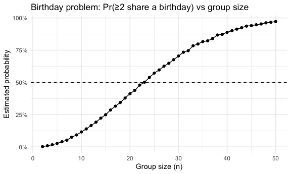
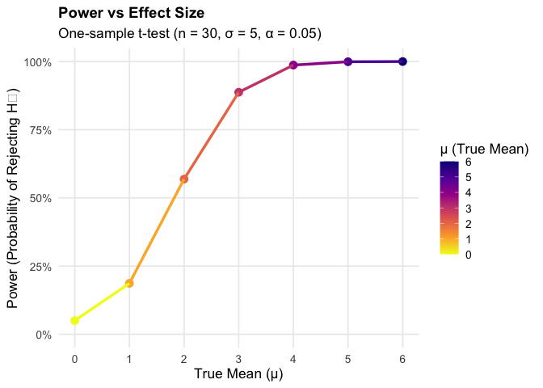
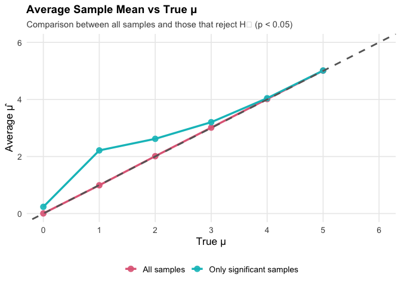
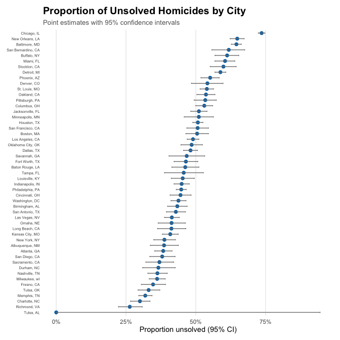

p8105_homework5
================
Jian Gao - jg5037
2025-11-11

- [Problem 1](#problem-1)
  - [Comment](#comment)
- [Problem 2](#problem-2)
  - [prob_2.1 Simulation of t-tests and plotting
    power](#prob_21-simulation-of-t-tests-and-plotting-power)
  - [prob_2.2 testing bias of sample mean: all samples vs significant
    samples](#prob_22-testing-bias-of-sample-mean-all-samples-vs-significant-samples)
- [Problem 3](#problem-3)
  - [prob_3.1 describe data](#prob_31-describe-data)
  - [prob_3.2 unsolved case rate in Baltimore,
    MD](#prob_32-unsolved-case-rate-in-baltimore-md)
  - [prob_3.3 Proportion tests for all
    cities](#prob_33-proportion-tests-for-all-cities)
  - [prob_3.4 Plotting proportion estimates with
    CIs](#prob_34-plotting-proportion-estimates-with-cis)

# Problem 1

``` r
# function to check if there are shared birthdays in a group of size n
set.seed(1)
bd_check <- function(n, days = 365) {
  bdays <- sample.int(days, size = n, replace = TRUE)
  any(duplicated(bdays))
}

# simulation for group sizes from 2 to 50
sim_df <-
  tibble(group_size = 2:50) |>
  mutate(prob = map_dbl(group_size, ~ mean(replicate(10000, bd_check(.x)))))

# make the plot
sim_df |>
  ggplot(aes(x = group_size, y = prob)) +
  geom_line() +
  geom_point() +
  geom_hline(yintercept = 0.5, linetype = 2) +
  scale_y_continuous(labels = percent_format(accuracy = 1)) +
  labs(
    title = "Birthday problem: Pr(≥2 share a birthday) vs group size",
    x = "Group size (n)",
    y = "Estimated probability"
  )
```

<!-- -->

## Comment

The plot shows that as group size increases, the probability that at
least two people share a birthday rises sharply.  
When the group size reaches about **23**, the probability exceeds
**50%**, illustrating the classic birthday paradox.  
Despite there being 365 possible birthdays, a group of only 23 people
already has a greater than even chance of a shared birthday, and the
probability approaches **100%** as the group size nears 50.

# Problem 2

``` r
n      <- 30      # sample size
sigma  <- 5       # population SD
mus    <- 0:6     # true means to consider
n_sim  <- 5000    # number of simulated datasets for each mu
alpha  <- 0.05    # significance level
```

## prob_2.1 Simulation of t-tests and plotting power

``` r
# for a given true mean mu, simulate n_sim datasets and perform t-tests
sim_ttest <- function(mu) {
  map_dfr(1:n_sim, function(i) {
    # generate random sample
    x <- rnorm(n, mean = mu, sd = sigma)
    
    # form one-sample t-test against H0: mu = 0
    tt <- t.test(x, mu = 0)
    
    tibble(
      mu      = mu,             # true mean
      mu_hat  = tt$estimate,    # sample mean
      p       = tt$p.value,     # p-value
      reject  = p < alpha       # whether we reject H0
    )
  })
}

# for all mus, simulate datasets and perform t-tests
sim_res <- map_dfr(mus, sim_ttest)
```

### Power calculation

``` r
power_df <-
  sim_res |>
  group_by(mu) |>
  summarise(power = mean(reject), .groups = "drop")

power_df
```

    ## # A tibble: 7 × 2
    ##      mu power
    ##   <int> <dbl>
    ## 1     0 0.05 
    ## 2     1 0.187
    ## 3     2 0.569
    ## 4     3 0.887
    ## 5     4 0.987
    ## 6     5 0.999
    ## 7     6 1

### Power plot

``` r
power_df |>
  ggplot(aes(x = mu, y = power, color = mu)) +
  geom_point(size = 3) +
  geom_line(linewidth = 1.2) +
  scale_color_viridis_c(option = "plasma", direction = -1) +
  scale_x_continuous(breaks = mus, limits = c(0, 6)) +
  scale_y_continuous(limits = c(0, 1), labels = scales::percent_format(accuracy = 1)) +
  labs(
    title = "Power vs Effect Size",
    subtitle = "One-sample t-test (n = 30, σ = 5, α = 0.05)",
    x = "True Mean (μ)",
    y = "Power (Probability of Rejecting H₀)",
    color = "μ (True Mean)"
  ) +
  theme_minimal(base_size = 13) +
  theme(
    plot.title = element_text(face = "bold", size = 14),
    legend.position = "right",
    panel.grid.minor = element_blank()
  )
```

<!-- -->

### Comment

The plot shows a clear positive relationship between the true mean (μ)
and the statistical power of the one-sample t-test.  
When μ = 0 (no true effect), the probability of rejecting the null
hypothesis is close to the nominal significance level (≈5%), as
expected.  
As μ increases, the power rises rapidly —\> around **μ = 2**, the test
reaches about 50% power, and by **μ ≥ 4** the power is nearly 100%.  
This pattern demonstrates that larger effect sizes make it much easier
to detect a true difference from zero, confirming the theoretical link
between effect size and test power.

## prob_2.2 testing bias of sample mean: all samples vs significant samples

``` r
# calculate average mu_hat for all samples and for only those that rejected H0
mu_df <-
  sim_res |>
  group_by(mu) |>
  summarise(
    mu_hat_all = mean(mu_hat),  # average of all sample means
    mu_hat_rej = mean(mu_hat[reject]),  # average of sample means where H0 was rejected
    .groups = "drop"
  )

mu_df
```

    ## # A tibble: 7 × 3
    ##      mu mu_hat_all mu_hat_rej
    ##   <int>      <dbl>      <dbl>
    ## 1     0    0.00500      0.236
    ## 2     1    0.992        2.21 
    ## 3     2    2.01         2.62 
    ## 4     3    3.01         3.20 
    ## 5     4    4.01         4.04 
    ## 6     5    5.01         5.01 
    ## 7     6    6.00         6.00

### Bias plot

``` r
# plot average mu_hat vs true mu for all samples and for rejected samples
mu_df |>
  pivot_longer(
    cols = c(mu_hat_all, mu_hat_rej),
    names_to = "which",
    values_to = "avg_mu_hat"
  ) |>
  ggplot(aes(x = mu, y = avg_mu_hat, color = which)) +
  geom_point(size = 3, alpha = 0.9) +
  geom_line(linewidth = 1.2) +
  geom_abline(slope = 1, intercept = 0, linetype = "dashed", color = "gray40", linewidth = 1) +
  scale_color_manual(
    values = c("mu_hat_all" = "#E16A86", "mu_hat_rej" = "#00BFC4"),
    labels = c("All samples", "Only significant samples")
  ) +
  scale_x_continuous(breaks = mus, limits = c(0, 6)) +
  scale_y_continuous(limits = c(0, 6)) +
  labs(
    title = "Average Sample Mean vs True μ",
    subtitle = "Comparison between all samples and those that reject H₀ (p < 0.05)",
    x = "True μ",
    y = "Average μ̂",
    color = NULL
  ) +
  theme_minimal(base_size = 13) +
  theme(
    plot.title = element_text(face = "bold", size = 14),
    plot.subtitle = element_text(size = 11, color = "gray30"),
    legend.position = "bottom",
    legend.box = "horizontal",
    panel.grid.minor = element_blank()
  )
```

<!-- -->

### Comment

The plot compares the average estimated sample mean (μ̂) with the true
population mean (μ) across all simulations.  
The red line (“All samples”) lies almost perfectly on the 45° reference
line, showing that the sample mean is an **unbiased estimator** of the
true mean — on average, μ̂ ≈ μ for any value of μ.

In contrast, the blue line (“Only significant samples”) is higher than
the 45° line when μ is small.  
This indicates that when we only look at samples where the null
hypothesis is rejected (p \< 0.05), the estimated means tend to be
**biased upward** — they appear larger than the true μ.  
This happens because only samples with unusually large random deviations
from zero are included among rejections (selection bias).

As μ increases and the power approaches 1, almost every sample leads to
rejection, so this bias disappears — the blue line converges back to the
45° line.

# Problem 3

``` r
homicide_data <- read_csv("dataset/homicide-data.csv")
```

    ## Rows: 52179 Columns: 12
    ## ── Column specification ────────────────────────────────────────────────────────
    ## Delimiter: ","
    ## chr (9): uid, victim_last, victim_first, victim_race, victim_age, victim_sex...
    ## dbl (3): reported_date, lat, lon
    ## 
    ## ℹ Use `spec()` to retrieve the full column specification for this data.
    ## ℹ Specify the column types or set `show_col_types = FALSE` to quiet this message.

``` r
head(homicide_data)
```

    ## # A tibble: 6 × 12
    ##   uid   reported_date victim_last victim_first victim_race victim_age victim_sex
    ##   <chr>         <dbl> <chr>       <chr>        <chr>       <chr>      <chr>     
    ## 1 Alb-…      20100504 GARCIA      JUAN         Hispanic    78         Male      
    ## 2 Alb-…      20100216 MONTOYA     CAMERON      Hispanic    17         Male      
    ## 3 Alb-…      20100601 SATTERFIELD VIVIANA      White       15         Female    
    ## 4 Alb-…      20100101 MENDIOLA    CARLOS       Hispanic    32         Male      
    ## 5 Alb-…      20100102 MULA        VIVIAN       White       72         Female    
    ## 6 Alb-…      20100126 BOOK        GERALDINE    White       91         Female    
    ## # ℹ 5 more variables: city <chr>, state <chr>, lat <dbl>, lon <dbl>,
    ## #   disposition <chr>

## prob_3.1 describe data

``` r
homicide_data <- homicide_data |> clean_names()
homi_summary <- homicide_data |>
  mutate(
    rep_date = ymd(reported_date, quiet = TRUE),
    year     = year(rep_date)
  ) |>
  summarise(
    n_rows   = n(),
    n_cols   = ncol(pick(everything())),
    city_n   = n_distinct(city),
    state_n  = n_distinct(state),
    year_min = min(year, na.rm = TRUE),
    year_max = max(year, na.rm = TRUE)
  )
homi_summary
```

    ## # A tibble: 1 × 6
    ##   n_rows n_cols city_n state_n year_min year_max
    ##    <int>  <int>  <int>   <int>    <dbl>    <dbl>
    ## 1  52179     15     50      28     2007     2017

``` r
# summarize total and unsolved homicides by city and state
city_summary <- homicide_data |>
  mutate(
    city_state = str_c(city, state, sep = ", "),
    unsolved   = disposition %in% c("Closed without arrest", "Open/No arrest")
  ) |>
  group_by(city_state) |>
  summarise(
    total    = n(),          # total homicides         
    unsolved = sum(unsolved),    # number of unsolved homicides      
    .groups  = "drop"
  )

head(city_summary)
```

    ## # A tibble: 6 × 3
    ##   city_state      total unsolved
    ##   <chr>           <int>    <int>
    ## 1 Albuquerque, NM   378      146
    ## 2 Atlanta, GA       973      373
    ## 3 Baltimore, MD    2827     1825
    ## 4 Baton Rouge, LA   424      196
    ## 5 Birmingham, AL    800      347
    ## 6 Boston, MA        614      310

### summary output

This raw dataset contains **52179** homicide records and **15**
variables, covering **50** cities in **28** states, with reports from
**2007** to **2017**.

## prob_3.2 unsolved case rate in Baltimore, MD

``` r
# First get the total number of cases and the number of unsolved cases in Baltimore, MD
#
balt_counts <- homicide_data |>
  mutate(
    city_state = str_c(city, state, sep = ", "),
    unsolved   = disposition %in% c("Closed without arrest", "Open/No arrest")
  ) |>
  filter(city_state == "Baltimore, MD") |>
  summarise(
    total    = n(),
    unsolved = sum(unsolved),
    .groups  = "drop"
  )

balt_counts
```

    ## # A tibble: 1 × 2
    ##   total unsolved
    ##   <int>    <int>
    ## 1  2827     1825

``` r
# for Baltimore, perform a proportion test for unsolved cases
balt_pt <- prop.test(
  x = balt_counts$unsolved,
  n = balt_counts$total
)


balt_tidy <- broom::tidy(balt_pt)

# extract estimate and confidence interval
balt_est <- balt_tidy |>
  select(estimate, conf.low, conf.high)

balt_est
```

    ## # A tibble: 1 × 3
    ##   estimate conf.low conf.high
    ##      <dbl>    <dbl>     <dbl>
    ## 1    0.646    0.628     0.663

### Comment

For the city of Baltimore, MD, the estimated proportion of unsolved
homicides is **64.6%**,with a 95% confidence interval from **62.8%** to
**66.3%**.

## prob_3.3 Proportion tests for all cities

``` r
# summarize total and unsolved homicides by city and state
city_prop <-
  homicide_data |>
  mutate(
    city_state = str_c(city, state, sep = ", "),
    unsolved   = disposition %in% c("Closed without arrest", "Open/No arrest")
  ) |>
  group_by(city_state) |>
  summarise(
    total    = n(),
    unsolved = sum(unsolved),
    .groups  = "drop"
  ) |>
  # for each city, perform a proportion test
  mutate(
    test = purrr::map2(unsolved, total, ~ prop.test(.x, .y)),
    tidy = purrr::map(test, broom::tidy)
  ) |>
  
  unnest(tidy) |>
  select(city_state, total, unsolved, estimate, conf.low, conf.high)

city_prop
```

    ## # A tibble: 51 × 6
    ##    city_state      total unsolved estimate conf.low conf.high
    ##    <chr>           <int>    <int>    <dbl>    <dbl>     <dbl>
    ##  1 Albuquerque, NM   378      146    0.386    0.337     0.438
    ##  2 Atlanta, GA       973      373    0.383    0.353     0.415
    ##  3 Baltimore, MD    2827     1825    0.646    0.628     0.663
    ##  4 Baton Rouge, LA   424      196    0.462    0.414     0.511
    ##  5 Birmingham, AL    800      347    0.434    0.399     0.469
    ##  6 Boston, MA        614      310    0.505    0.465     0.545
    ##  7 Buffalo, NY       521      319    0.612    0.569     0.654
    ##  8 Charlotte, NC     687      206    0.300    0.266     0.336
    ##  9 Chicago, IL      5535     4073    0.736    0.724     0.747
    ## 10 Cincinnati, OH    694      309    0.445    0.408     0.483
    ## # ℹ 41 more rows

## prob_3.4 Plotting proportion estimates with CIs

``` r
city_prop |>
  mutate(city_state = fct_reorder(city_state, estimate)) |>
  ggplot(aes(y = city_state, x = estimate)) +
  geom_point(color = "#0072B2", size = 2) +
  geom_errorbar(
    aes(xmin = conf.low, xmax = conf.high),
    width = 0.2,
    color = "gray50",
    orientation = "y"
  ) +
  scale_x_continuous(labels = scales::percent_format(accuracy = 1)) +
  labs(
    title = "Proportion of Unsolved Homicides by City",
    subtitle = "Point estimates with 95% confidence intervals",
    x = "Proportion unsolved (95% CI)",
    y = NULL
  ) +
  theme_minimal(base_size = 11) +
  theme(
    plot.title = element_text(face = "bold", size = 15),
    plot.subtitle = element_text(size = 10, color = "gray40"),
    axis.text.y = element_text(size = 5.5),
    panel.grid.minor = element_blank(),
    panel.grid.major.y = element_blank(),
    plot.margin = margin(10, 10, 10, 10)
  )+ coord_cartesian(clip = 'off')
```

<!-- -->

### Comment

The plot displays the estimated proportion of unsolved homicides for
each city,  
along with corresponding 95% confidence intervals.

- Across all 51 U.S. cities, the proportion of unsolved cases ranges  
  from **0.0%** to**73.6%**.

- Cities such as **Chicago, IL** show the highest estimated unsolved
  rate of about **73.6%**,while **Tulsa, AL** has the lowest rate at
  approximately **0.0%**.

The increasing pattern from bottom to top highlights substantial
variation in homicide case resolution rates across cities.
